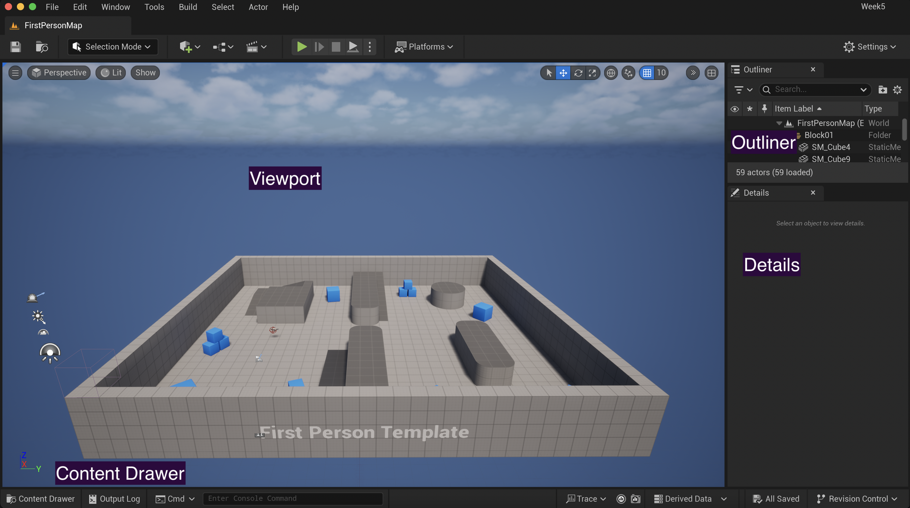
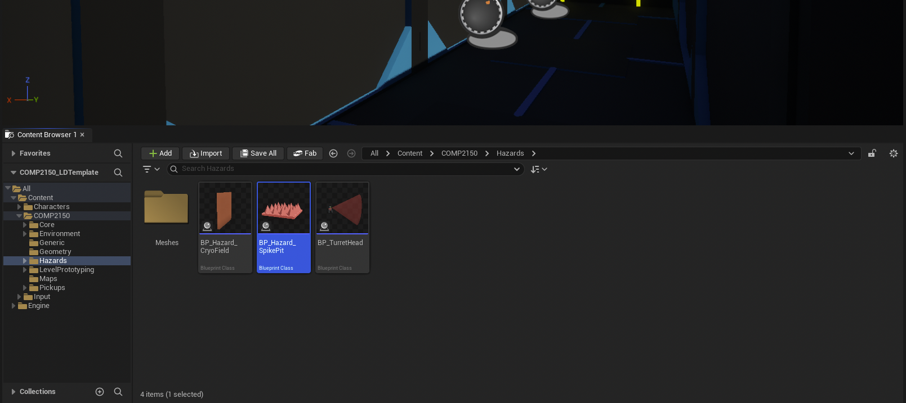
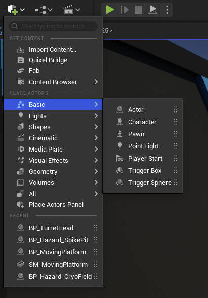

# Getting Started With Unreal Engine

This document is meant as a resource to help you get started with using Unreal Engine. If you're already familiar with Unreal, such as through COMP1170 or your own studies, you may already know a lot of this. However, feel free to come back to this document whenever you need to brush up on the fundamentals of using the engine.

Note: additional features, like working with materials, will be introduced when necessary in class.

The default layout of Unreal Engine should look somewhat familiar to you if you've used Unity, Blender, or other game and 3D modelling tools. But it has its own quirks Taking a look at the main view of Unreal Engine, we can see:

* Viewport: The main view of our level. This is where we can arrange our objects and navigate our space.

* Outliner: A hierarchical view of all the objects and folders in our level. We can turn the visibility of these on and off, and search for certain elements in our levels as well.

* Details: The details (such as different components/blueprints attached) of the currently selected object.

* Content Drawer: By default this is tucked away, but will be useful later and store all the assets inside our project. You can add this to your main view by pressing "Dock in layout."

## Navigating The Viewport
As a level designer, you'll spend a lot of your time working in the viewport. Spend some time flying around the viewport to get familiar with it all. Controls in brief:

* Holding left click and moving the mouse left and right will pan left and right.
* Holding right click and moving the mouse will pan left and right and tilt up and down.
* Holding both mouse buttons, or the middle mouse button, will move the camera side to side, up and down.
* With any of these mouse buttons pressed, pressing the WASD keys will "fly" through the environment.
* The scroll wheel will zoom in and out.

# Placing and manipulating objects
To modify the position, scale or rotation of an object, you'll first want to select it. You can do this either in the Viewport directly, or by finding it in the Outliner. It's a good idea to keep our items in folders, and name them when appropriately, to make this easier.

### Quickly finding objects
The outliner has a search bar at the top that you can use to quickly find objects within the scene and select them. When you have, they will be higlighted in the viewport and outliner.

### Focusing on an object
Once you've selected an object, you can press the F key to zoom in on them in the viewport.

### Transforming an object
To transform an object, first make sure you have the right transformation tool selected. You can change which tool you are using by pressing the corresponding icon in the toolbar attached to the viewport. 

These buttons are, in order:

* Select: Allows you to select an object. (Hot key: Q)
* Translate: Allows you to move an object's location. (Hot key: W)
* Rotate: Allows you to change the rotation of an object.(Hot key: E)
* Scale: Allows you to change the size of an object.(Hot key: R)

Along this tool bar, there are few other handy toggles for you to explore:

* Coordinate Space: Allows you to switch between working in an object's local coordinates or the world coordinates. Useful for when you want to move an object in a specific way.
* Surface snap: A toggle that allows you to set whether an object will snap to the nearest surface when moving it around in the viewport. Very, very andy to have turned on.
* Snap amounts for transformations: Allows you to set (or turn off) the increments in which an object will snap between different transformations. Very handy to keep things lined up nicely and uniform!

Spend a bit of time manipulating a few objects in the level. See if you can realign the geometry in the starting area to something you prefer. This will get you familiar with the tools you'll need to rapidly create levels.

### Duplicating Objects
To duplicate an object, either right click the object in the viewport and select duplicate, or hold down the ALT key while performing a transformation to essentially "pull out" a clone from the original object. Very handy for building out geometry once you've got a few pieces in place!

### Moving to camera
If it's easier for you to fly your camera to where you want the object to be than to move it there, you can right click on an object in the Outliner and select "Move object to camera" to have it move to that position. You'll generally need to do some re-adjustments from here.

# Adding and removing objects

## Placing objects in the scene
To place an object in the scene, first find it in the content drawer, then drag it into the viewport.

## Deleting objects
To delete an object, select it in the viewport or outliner and press the delete key on your keyboard.

## The player object
If you need to put the player in the game world, click the small Cube with a green plus above the Viewport, and navgiate to Basic > PlayerStart. This will create a player object that will spawn into the world and bring the camera, controls, etc. along with it. You should only have one of these in your game world at any time.

## Combining objects
You may wish to combine objects together in your scene, such as childing a spike pit to a moving platform. To do so, place both items into your scene. Then, in the outliner, select the object you wish to child to another and drag-and-drop it onto the other object.

Much like parent-child relationships in other 3D engines, the child object will now inherit transformation qualities from the parent. This is a great way to start experimenting with mechanics and making your game unique!

Note that you can save these combinations by creating Level Instances and Level Packed Actors. We'll be exploring these next week as a way to better author your own encounters and layouts.

